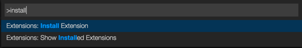
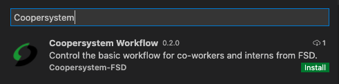
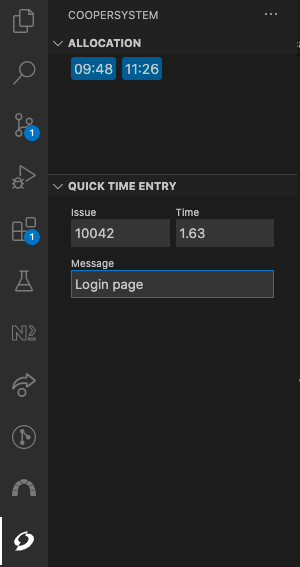

# Coopersystem Workflow for Visual Studio Code

Control the basic workflow for co-workers and interns from FSD.

## Intalllation

1. Press `F1` or `⌘ + Shift + P` and type `install`. Pick `Extensions: Install Extension`.

    

2. Type `coopersystem` and hit `enter`.

    

3. Restart Visual Studio Code.

## Configuring

1. Press `F1` or `⌘ + Shift + P` and type `settings json`. Pick `Preferences: Open Settings (JSON)`.

2. Add the following configurations and replace with your LDAP credentials:

  ```json
    // Coopersystem Workflow
    "coopersystem.ldap.username": "your-username",
    "coopersystem.ldap.password": "your-password"
  ```

  (Optional) If you are an intern you can defined the following configuration to use local allocation manager driver. More defails in [Coopersystem Workflow SDK](https://github.com/coopersystem-fsd/workflow-sdk-nodejs#allocation):

  ```json
  "coopersystem.userType": "intern",
  ```

  NOTE: The default value of this config is `coWorker`.

## Usage

Click in the Coopersystem icon shown on your VSCode activity bar.

You should see a screen similar to this:



Now you can checkin, checkout and create a quick time entry.

## TODO

- Checkin e Checkout
- Testes unitários
- Verificar possibilidade de embedar extensão do redmine
- Vericar se o ícone está com as definições certas: https://code.visualstudio.com/api/references/contribution-points#Icon-specifications
